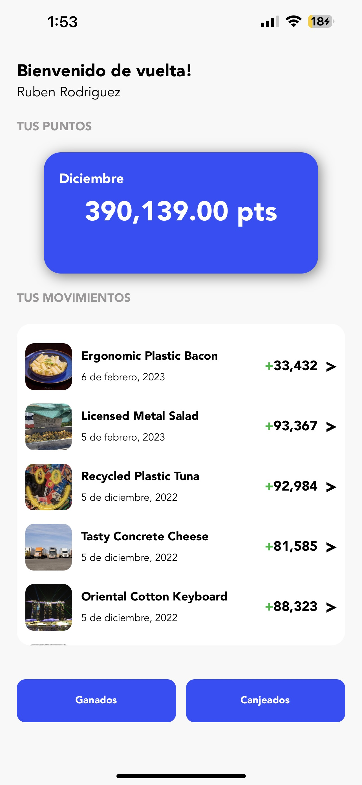
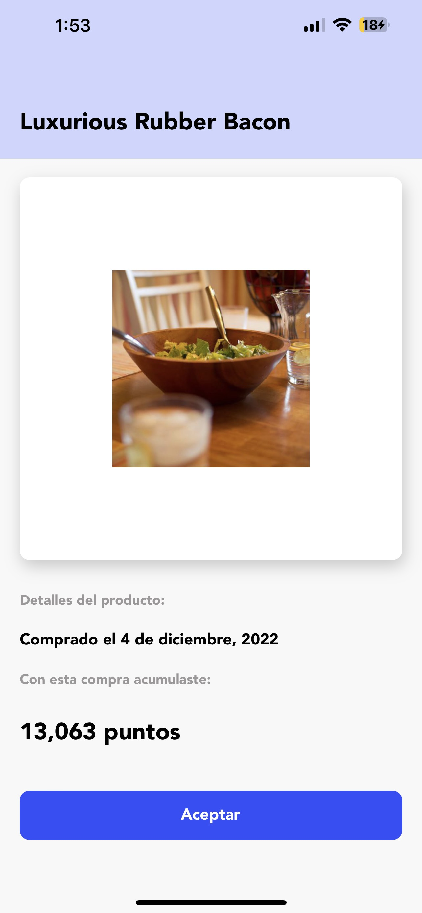
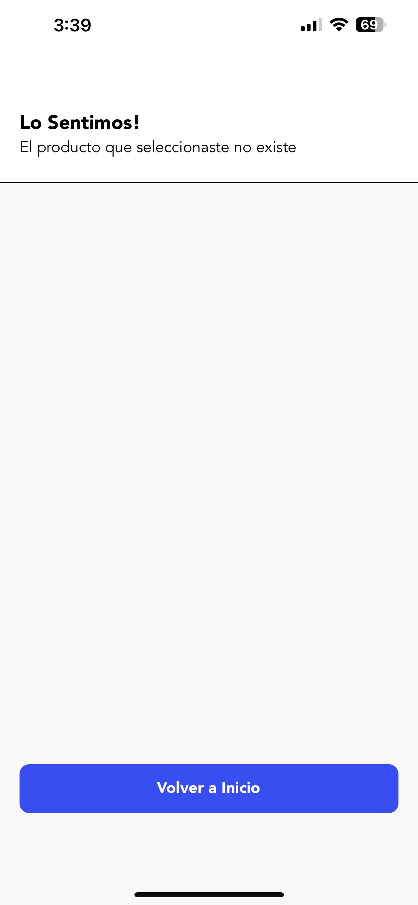
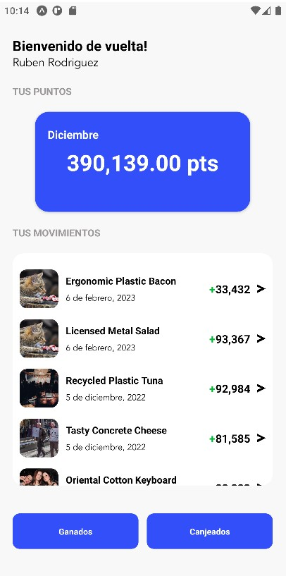
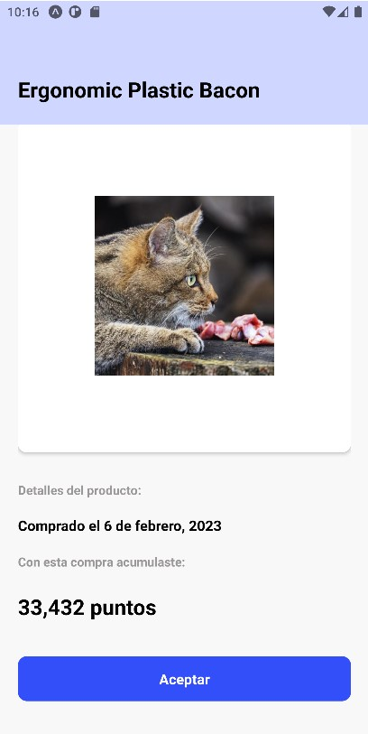
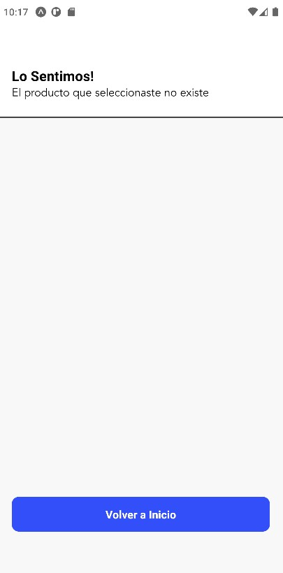

# expo-type-testing

**Description**

Mobile app developed with Expo and React Native for products display.

**Screenshots IOS**

    
    
    

**Screenshots Android**

    
    
    

**Prerequisites**

Be sure that you have already installed:
- NodeJs version 16.14.2.
- Yarn.
- Expo.
- Git.
- Expo Go app in a smartphone.

**Instructions**

- run in your git console `git clone https://github.com/fimbres/expo-type-testing.git`
- run `cd expo-type-testing`
- run  `yarn install` or just `yarn`
- Open the project with your IDE.
- run `expo start`
- scan the QR code using your smartphone. (this should open your Expo Go app with the `expo-type-testing` running on your smartphone)
- if you want to run all the unit tests around the app, run `yarn test`
